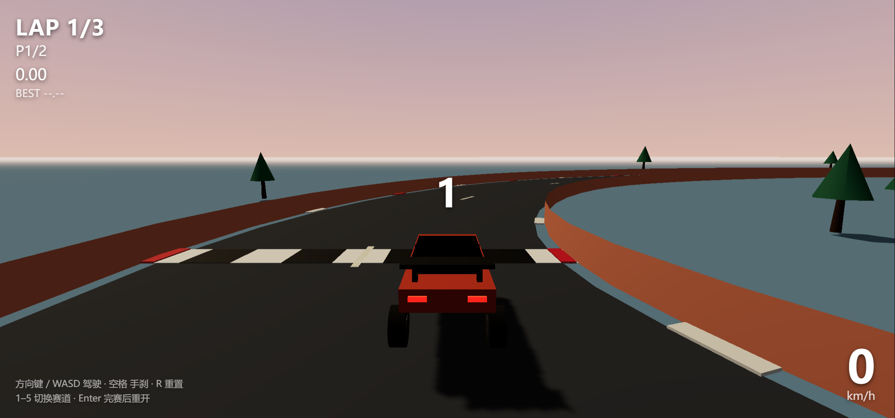
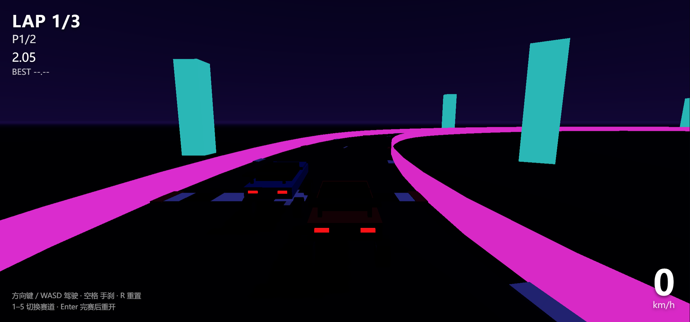

# 03 · 弯心 APEX · 3D 赛车竞速

五条赛道的 3D 竞速游戏：真实物理（Rapier raycast 车辆）、物理驱动的 AI 对手、
软边界防翻车、连续 trimesh 路面。sim 层零 three、零 DOM，可被 Node 无头跑通；
渲染层由无头 Chrome CDP 端到端验证。




## 技术栈

| 项 | 版本 | 说明 |
|---|---|---|
| three.js | 0.186.0 | 渲染 |
| @dimforge/rapier3d-compat | 0.20.0 | 物理（WASM，compat 版免打包配置） |
| TypeScript | 7.0.2 | 严格模式 |
| Vite | 8.3.0 | dev 端口 **5179**（strictPort） |

## 运行

```bash
npm install
npm run dev        # http://127.0.0.1:5179/
npm run bot        # 无头仿真验证（Node 直跑 sim 层，不进浏览器）
npm run typecheck  # tsc --noEmit
npm run build      # 产物 ~3.4MB（Rapier WASM 内联，警告无害）
```

浏览器验证（需先起 dev server + 无头 Chrome 调试端口 9222）：

```bash
node tools/verify-render.mjs 9222 http://127.0.0.1:5179/ ../../_tmp
```

## 操作

方向键 / WASD 驾驶 · 空格 手刹 · R 重置到检查点 · 1–5 切换赛道 · Enter 完赛后重开

## 架构

```
src/sim/      零 three、零 DOM —— 物理与规则，Node 可直接跑（bot 依赖这一点）
  track.ts      5 条赛道定义（中心线 + 宽度 + 主题）
  road.ts       中心线 → 连续 trimesh 路面网格（替代分段长方体，消除接缝颠簸）
  vehicle.ts    Rapier DynamicRayCastVehicleController 封装
  race.ts       比赛/圈数/检查点/软边界力场/翻车恢复
  ai.ts         纯追踪 + 前瞻曲率模型
  drive.ts      输入类型
src/render/   three.js 视觉（track.ts 主题化路面、car.ts 方块车）
src/ui/hud.ts DOM 叠层 HUD
src/main.ts   唯一胶水：固定步长循环 + 追尾相机 + 键盘输入 + window.__apex 调试快照
tools/        bot-run.ts（仿真验证）/ verify-render.mjs（CDP 验证）/ probe-car.mjs（渲染探针）
```

## 关键物理调参（踩坑记录）

- **整车质量 ≈ 1000kg**（chassis density 62）。曾用 1.1 → 整车仅 17.6kg，
  5200N 引擎力直接让车起跳后仰翻，卡死在赛道上。质量必须与推力同量级。
- **软边界力场替代实体护栏**：靠近路缘 1.2m 内施加向内冲量（越出越强）。
  实体薄护栏会把打滑的车撞翻；低护栏又会被碾过去冲出赛道。
- **AI 过弯按最小曲率取安全速度** `v = √(μ·R)·margin`（R 取前瞻样本中的最小转弯半径，
  不是平均）。平均半径会在 S 弯入口超速。
- **翻车恢复**：up 向量 y 分量 < 0.5 持续 0.5s → 重置到检查点，杜绝卡死死循环。
- **横向抓地 latGrip 必须保持 7.5**：再高，落日/风暴两图的急弯会侧翻。

## 验证基线（2026-09-24）

- 仿真 `npm run bot`：**6/6** —— B1 五图全部 3 圈完赛；B2 单圈 22–35s；
  B2b 极速 85–153km/h；B2c 每图重置 ≤ 6；B3 决定性一致；B4 无 NaN。
- 渲染 `tools/verify-render.mjs`：**7/7** —— GPU 直出（ANGLE/D3D11 实测 RTX 4060）、
  零运行时报错、倒计时→racing、油门加速 24.7m/s、左转 Δheading 0.87rad、截图非空白。

已知非缺陷：无头 Chrome 帧率低时，相机 lerp（按 1/60 计算步长）会短暂跟不上高速车辆，
行驶中截图可能 momentarily 丢车；相机稳定后取景正常（见 screenshots/chase-view.png）。
